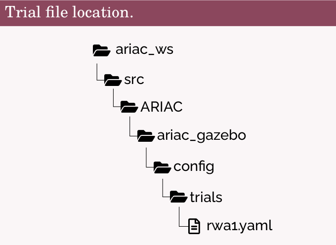

# RWA1

## Tasks 
- Starting the Competition
- Retrieving Orders
    - representing Orders using OOP and storing them in a data structure.
- Submitting Orders
- Ending the Competition

[RWA1](RWA1/RWA1_ENPM663_SPRING2023.pdf)

## Execution

1. Launch the ARIAC environment with rwa1 trail file.

    ```
       $ ros2 launch ariac_gazebo ariac.launch.py trial_name:=rwa1
    ```

    Note: Initially, [rwa1.yaml](RWA1/rwa1.yaml) needs to be placed inside the config/trials folder present in the ariac_gazebo package (as shown in the package structure below)

    


3. Launch CCS

    ```
       $ ros2 launch ARIAC-2023 ccs.launch.py
    ```

## Example Output
