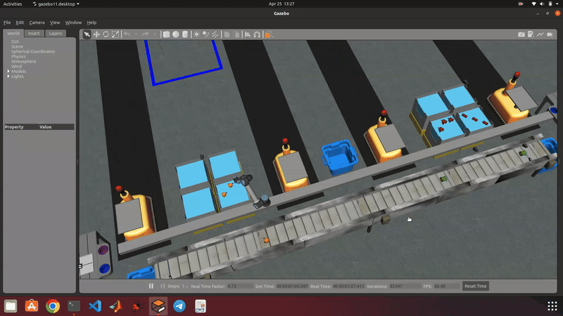

# RWA3

## Tasks 
This assignment consists of building one kitting task order. The order is announced
at the beginning of the competition. This order needs 2 parts from the conveyor belt
and 2 parts from the bins.
- Start the Competition (RWA1).
- Parse the Order published (RWA1).
- Locate parts required in the orders (RWA2), use cameras to do so.
- Locate tray required in the Order (use cameras).
- Perform the task within the Order:
    - Move parts from conveyor belt to bins.
    - Move tray from table to AGV.
    - Move parts from bins to tray.
- Move the AGV to the warehouse.
- Submitting Orders (RWA1).
- Ending the Competition (RWA1).

An in detail Assignment description can be found in
[RWA3](RWA3/RWA3_ENPM663_SPRING2023.pdf)

## Sensor/Camera Placements
This assignment requires the use of cameras and sensors, thus we need to create a sensor configuration file. [sensors.yaml]() is present in the config folder.


## Execution

1. Launch the ARIAC environment with the rwa2 trail file.

    ```
       $ ros2 launch ariac_gazebo ariac.launch.py trial_name:=rwa3 competitor_pkg:=ARIAC-2023 sensor_config:=sensors
    ```

    Note: Initially, [rwa3.yaml](RWA3/rwa3.yaml) needs to be placed inside the config/trials folder present in the ariac_gazebo package (as done in previous assignments)


3. Launch CCS

    ```
       $ ros2 launch ARIAC-2023 ccs.launch.py
    ```

## Example Output

RWA 3 run (16x)




