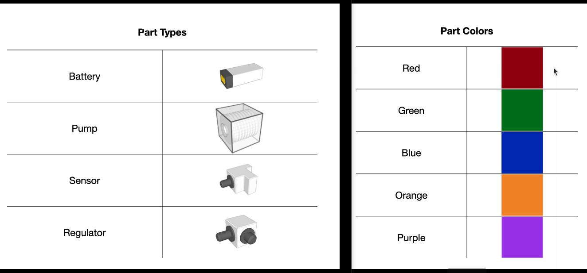

# Overview
The ARIAC competition, hosted by NIST, annually challenges robots to perform diverse tasks in a dynamic warehouse environment. Agility here encompasses adaptability, efficiency, and autonomy, crucial for real-world manufacturing. Insights from the competition inform the development of standard metrics and test methods for robotic agility in manufacturing.
The competition consists of two main actors, the CCS and the AM. The competition is set to different states while running, and the CCS needs to subscribe to the topic ```/ariac/competition_state``` to implement the programming logic properly.

- Competitor Control System (CCS): Competitors' software responsible for communication with the competition environment and task execution.
- ARIAC Manager (AM): The interface for competitors, providing simulation environment and ROS interfaces.

Further detailed information about the competition overview can be found [here](https://pages.nist.gov/ARIAC_docs/en/2023.5.0/competition/overview.html)

# Installation
For installing ARIAC please visit [ARIAC Installation](https://pages.nist.gov/ARIAC_docs/en/2023.5.0/getting_started/installation.html) page.

Note: ARIAC 2023 is built for ROS2 Galactic running on Ubuntu 20.04 (Focal Fossa).

# Environment

 - Parts - There are four unique part types and each part can be one of five colors.

An in detail information about the ARIAC environment can be found [here](https://pages.nist.gov/ARIAC_docs/en/2023.5.0/competition/environment.html)

# Tasks 
## Kitting Task
In a kitting task, the Competitor Control System (CCS) is required to:
- Position a kit tray onto one of the four AGVs.
- Place parts onto the kit tray within a designated quadrant.
- Guide the AGV to the warehouse.
- Evaluate the submitted kit for scoring.

## Assembly Task
Assembly is a manufacturing process where interchangeable parts are sequentially added to a product to create the final product.
- Lock the AGV trays.
- Move the AGVs to the correct assembly station.
- Call the pre-assembly poses service.
- Assemble the parts into an insert.
- Submit the assembly for scoring.

## Combined Task
In a combined task, the Competitor Control System (CCS) is required to execute a kitting task followed by an assembly task.

# Agility Challenge
A scenario or set of scenarios in ARIAC is designed to test robotic adaptability and efficiency in dynamic manufacturing environments. There are 8 possible agility challenges in ARIAC 2023. Besides the Human challenge, all other challenges can occur multiple times in a trial.

## High-priority Orders
The high-priority orders challenge simulates an order that takes precedence over regular-priority orders. The CCS must complete and submit the high-priority order before processing regular-priority orders. This challenge assesses the CCS's capability to prioritize high-priority orders, requiring it to detect the announcement of a high-priority order and switch tasks accordingly.

## Insufficient Parts
The insufficient parts challenge replicates a scenario where the workcell lacks the necessary parts to fulfill one or more orders.
This challenge aims to evaluate the CCS's ability to recognize insufficient parts for fulfilling orders. During this challenge, the CCS must submit orders even if they are incomplete due to the shortage of parts.

## Conveyor Belt
The challenge evaluates the CCS's capability to identify required parts from the conveyor belt through the topic ```/ariac/conveyor_parts```. It assesses the CCS's ability to utilize suitable robots to retrieve parts from the belt and store them appropriately.


## Faulty Parts
Faulty parts are components that are deemed unsuitable for competition use due to their poor condition. The challenge aims to assess the CCS's capability to: 
- Effectively utilize the quality check sensor for identifying faulty parts.
- Substitute faulty parts with new ones.


## Flipped Parts
The challenge aims to assess the CCS's method for flipping parts when the environment starts with parts in an upside-down orientation. This evaluation focuses on the CCS's strategy for correcting the orientation of flipped parts to ensure they are properly aligned for use in orders.


Further detailed information about these and the remaining agility challenges can be found [here](https://pages.nist.gov/ARIAC_docs/en/2023.5.0/competition/challenges.html#agility-challenges)


RWA 4 run (16x)


