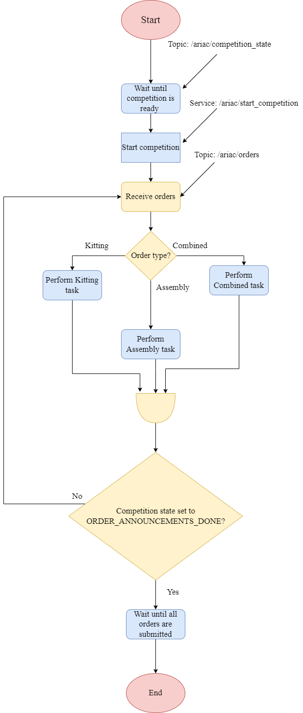
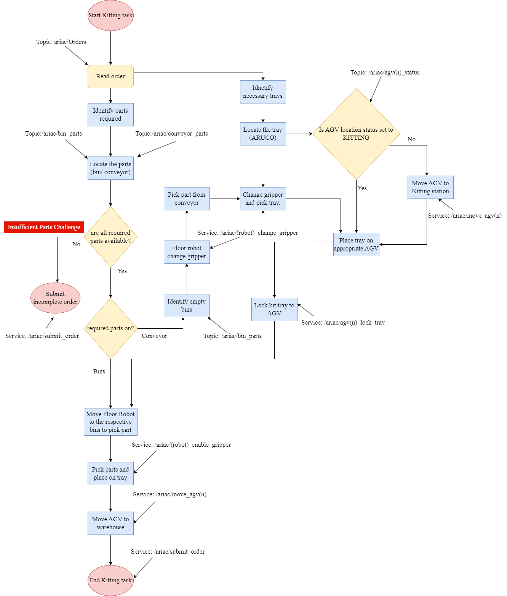
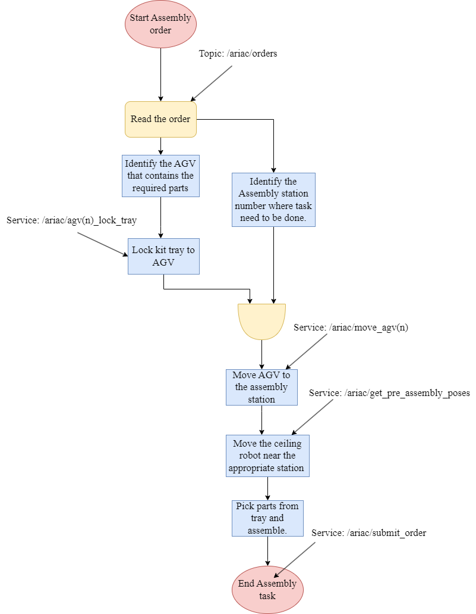
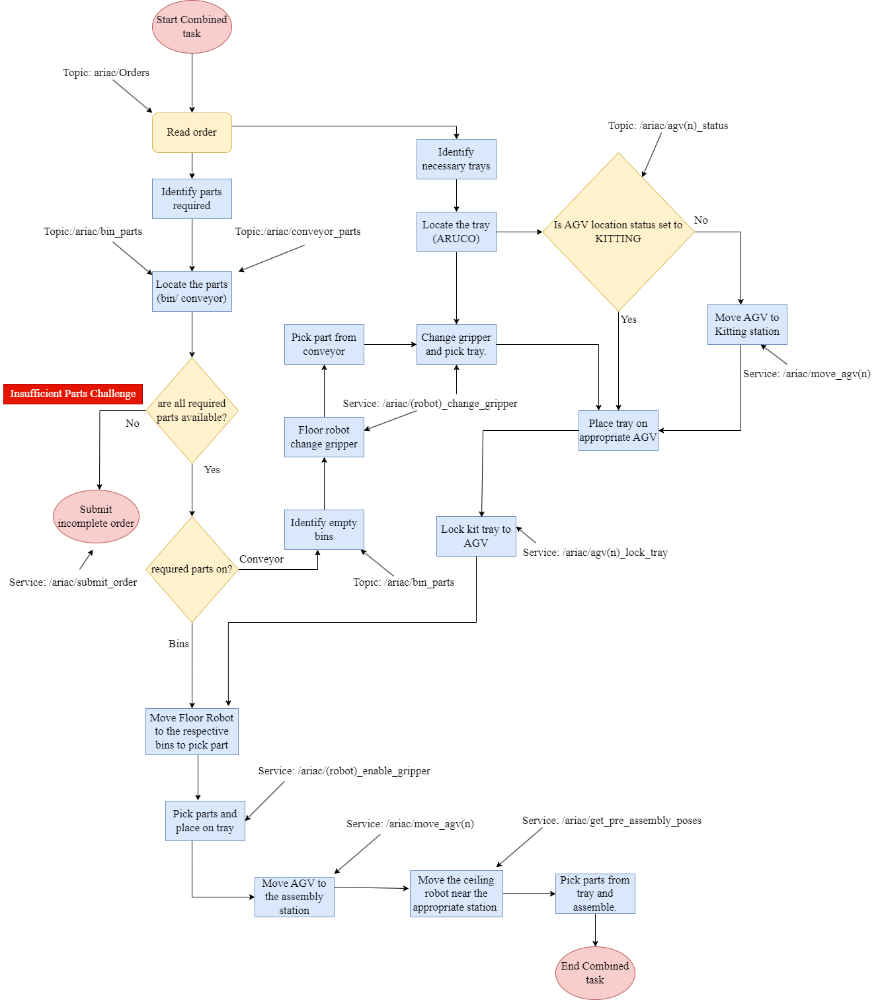
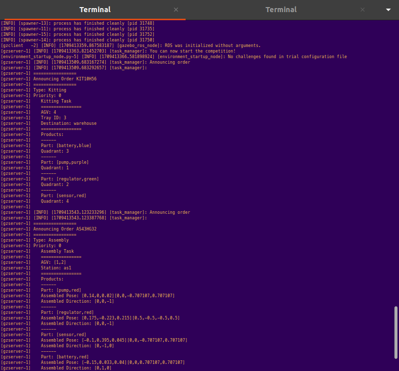
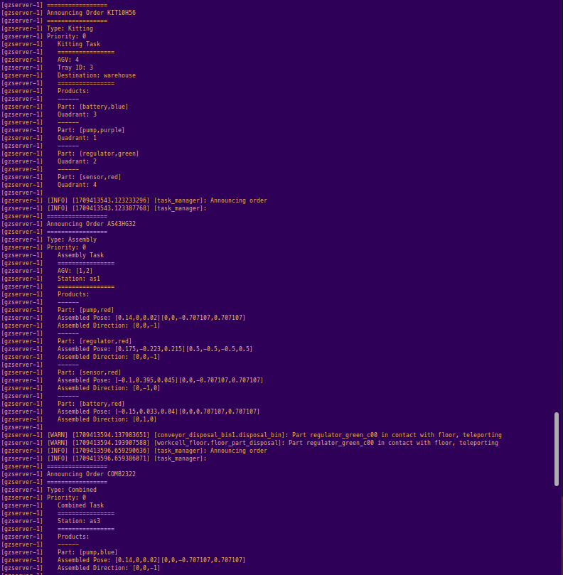
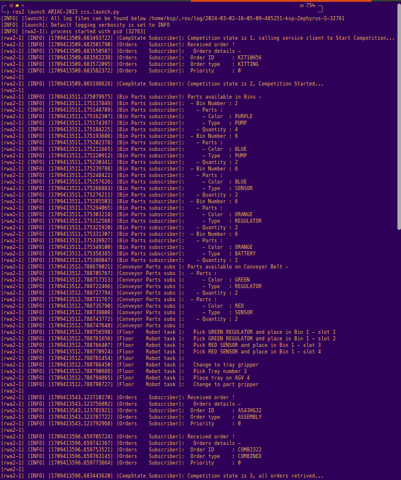
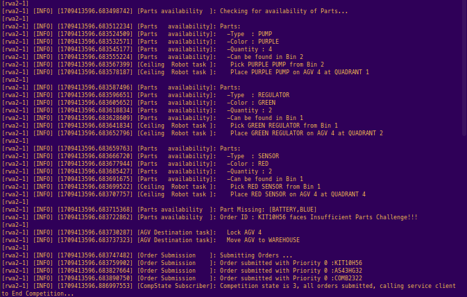

# RWA2

## Tasks 
- Starting the Competition (RWA1).
- Retrieving Orders (RWA1).
- Locate parts required in the orders.
- Identify challenges.
- Call functions to do Kitting/Assembly.
- Submitting Orders (RWA1).
- Ending the Competition (RWA1).

[RWA2](RWA2/RWA2_ENPM663_SPRING2023.pdf)

## Task-level Planning
Task-level planning consists of high-level actions to complete tasks. These actions will eventually be translated to low-level commands (motion planning), the latter will be covered later.

- CCS Pipeline    

- Kitting Task Pipeline

- Assembly Task Pipeline

- Combined Task Pipeline


## Execution

1. Launch the ARIAC environment with rwa2 trail file.

    ```
       $ ros2 launch ariac_gazebo ariac.launch.py trial_name:=rwa2
    ```

    Note: Initially, [rwa2.yaml](RWA2/rwa2.yaml) needs to be placed inside the config/trials folder present in the ariac_gazebo package (as shown in the package structure below)

    


3. Launch CCS

    ```
       $ ros2 launch ARIAC-2023 ccs.launch.py
    ```

## Example Output
ARIAC server terminal



CCS terminal


