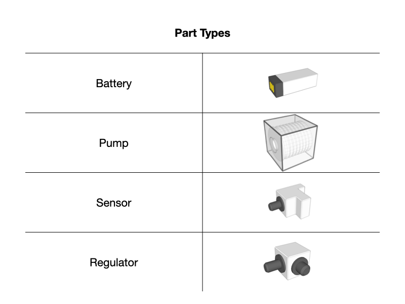

# Overview
The ARIAC competition, hosted by NIST, annually challenges robots to perform diverse tasks in a dynamic warehouse environment. Agility here encompasses adaptability, efficiency, and autonomy, crucial for real-world manufacturing. Insights from the competition inform the development of standard metrics and test methods for robotic agility in manufacturing.
The competition consists of two main actors, the CCS and the AM. The competition is set to different states while running, and the CCS needs to subscribe to the topic ```/ariac/competition_state``` to implement the programming logic properly.

- Competitor Control System (CCS): Competitors' software responsible for communication with the competition environment and task execution.
- ARIAC Manager (AM): The interface for competitors, providing simulation environment and ROS interfaces.

Further detailed information about the competition overview can be found [here](https://pages.nist.gov/ARIAC_docs/en/2023.5.0/competition/overview.html)

# Installation
For installing ARIAC please visit [ARIAC Installation](https://pages.nist.gov/ARIAC_docs/en/2023.5.0/getting_started/installation.html) page.

Note: ARIAC 2023 is built for ROS2 Galactic running on Ubuntu 20.04 (Focal Fossa).

# Environment


### Parts
There are four unique part types and each part can be one of five colors.

  
- Agility Challenge: A scenario or set of scenarios in ARIAC designed to test robotic adaptability and efficiency in dynamic manufacturing environments.

# RWA4

## Assignment Description
This assignment consists of completing a combined task and a kitting task.
- The Order with the combined task is announced at the beginning of the competition. For the kitting part of the combined task, use the tray with id 0.
- The Order with the kitting task is announced 50s after the competition has started. This second Order is a high-priority Order which should be handled as soon as it is announced.

An in detail Assignment description can be found in
[RWA4](RWA4/RWA4_ENPM663_SPRING2023.pdf)

## Challenges
- High-priority Order: A kitting Order, which is of high-priority, is announced 50 s after the competition has started. For this assignment, you will use the floor robot to perform kitting (including kitting during a combined task) and the ceiling robot to perform assembly. The high-priority Order must be started as soon as it is announced. If the robot is holding a part when the new Order is announced, the competitor control system (CCS) should place the part before starting working on the new Order. Once the high-priority Order is completed, the CCS should resume the other Order. There is a need to keep track of the steps within an Order so it can be resumed.
- Faulty Part Challenge: The first part placed in quadrant on AGV 4 is faulty. Once a part is detected as faulty, it must be removed and replaced with another one. Make sure you discard the faulty part in one of the blue bins.

## Execution

1. Launch the ARIAC environment with the rwa2 trail file.

    ```
       $ ros2 launch ariac_gazebo ariac.launch.py trial_name:=rwa4 competitor_pkg:=ARIAC-2023 sensor_config:=sensors
    ```

    Note: Initially, [rwa4.yaml](RWA4/rwa4.yaml) needs to be placed inside the config/trials folder present in the ariac_gazebo package (as done in previous assignments)

2. Launch the move_group node

    ```
       $ ros2 launch ariac_moveit_config ariac_robots_moveit.launch.py
    ```

3. Launch CCS

    ```
       $ ros2 launch ARIAC-2023 ccs.launch.py
    ```

## Example Output

RWA 4 run (16x)


